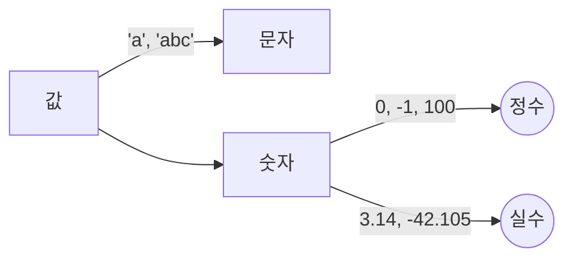

0221
# today!!!!!요약!!!!!

## 프로그래밍 


[프로그래밍] -- 변수, 연산자 --> [값을 다루는것]

			 -- for문, if문 --> [흐름]


## 변수 

> **값을 담는 그릇**

|종류|변수타입|
|--|--|
|정수|int i =10;|
|문자|char ch = 'A';|
|실수|double d = 3.14;|

> ```int``` **가 변수 타입:  즉, 값을 담을 그릇의 종류**

## 값


[값] -- 'a', 'abc' --> [문자]

[숫자]

 0, -1, 100 -->((정수))
 
 3.14, -42.105 -->((실수))
 


> **모든 값에는 ```타입```이 있다.** 

>**"타입"을 모르면 값을 해석할 수 없다.**

 
> 컴퓨터는 0, 1 밖에 모르기 때문에 해석하려면 ```타입```을 알아야한다.

## 이클립스 단축키 

>``` ctrl```+ ```space``` : 자동완성

> ```alt``` + ```up, down``` : 행이동

> ```ctrl```+```/``` : 주석(toggle)

> ```ctrl```+```D``` : 한줄 삭제

> ```ctrl```+```shift```+```F```: 자동 정렬

> ```ctrl```+```shift```+```O``` : 자동 import


https://colorscripter.com/

# today!!!!진도!!!!

# Chapter 02 변수

### 1. 변수와 상수

#### 1.1 변수란?

> **Note** **"변수란, 단 하나의 값을 저장할 수 있는 메모리 공간."**

#### 1.2 변수의 선언과 초기화


변수를 선언하면, 메모리의 빈 공간에 **'변수타입'** 에 알맞은 크기의 저장공간이 확보되고, 앞으로 이 저장공간은 **'변수이름'** 을 통해 사용 할 수 있게 된다.

##### 변수의 초기화

>**Note** **"변수의 초기화란, 변수를 사용하기 전에 처음으로 값을 저장하는 것"**

```
int age = 25;	// 변수 age를 선언하고 25로 초기화 한다.
```


[age] -- 25로 초기화 --> ((age=25))


```
int a;
int b;
int x =0;
int y = 0;
```

> ▼ ' , '콤마 구분자로 한줄에 여러 변수 선언 가능 ▼ 

```
int a, b;
int x = 0, y = 0;
``` 

* 대입연산(=) - 덧셈 처리과정

```
 year = age + 2000;
- > year =  14 + 2000;	// 변수 age에 저장된 값(14)를 읽어와서 식에 사용
- > year = 2014;		// 변수 age에 2014를 저장한다.
```

* 대입연산(=) - 1씩 증가
```
// 아래 세 코드는 같은 결과를 도출한다.
	age = age + 1;
- > age++;				// ++(후위연산자) 이용
- > age += 1;			// += 연산자 이용
```

##### 두 변수의 값 교환하기

```
int x = 10;		-->		int x = 20;
int y = 20;				int y = 10;
```

> **Note** **두 변수의 값 교환 시 임시저장소 ```int tmp``` 를 하나 더 선언 한다.**

* 교환 순서

```
tmp = x;	// 	1. 변수 x에 저장된 값을 변수 tmp에 저장
x = y;		//	2. 변수 y에 저장된 값을 변수 x에 저장
y = tmp;	// 	3. 변수 tmp 에 저장된 값을 변수 y에 저장
```

#### 1.3 변수의 명명규칙

1. **대소문자 구분** 길이에 제한 X (True와 true 는 다름)
2. **예약어 사용 X** (true 예약어라 불가)
3. **숫자 시작 X** (7up 불가 top10 가능)
4. **특수문자는 '_'와 '$'** 만을 허용 (#Sarp 불가 $arp 가능)

* 기타 규칙

1. 클래스 이름의 **첫 글자는 항상 대문자**
	- **변수와 메서드**의 이름의  **첫글자는 항상 소문자**  
2. **여러 단어**로 이루어진 이름은 단어의 **첫글자를 대문자로** (lastIndexOf, StringBuffer)
3. **상수**의 이름은 모두 대문자, 여러단어 '_'로 구분 (PI, MAX_NUMBER)
4.  선언문에 **주석** 사용하기

### 2. 변수의 타입


> Note 문자는 정수에 속한다.

##### 기본형과 참조형
* **기본형(primitive type)**
	* 논리형(boolean), 문자형(char), 정수형(byte, short, int, long), 실수형(float, double)
* **참조형(reference type)**
	* 객체의 주소를 저장한다. 8개의 기본형을 제외한 나머지 타입

#### 2.1 기본형(primitive type)

|분류|타입|
|:--:|:--:|
|논리형|boolean(true/false)|
|문자형|char|
|정수형|int|
|실수형|double|

|종류/크기|1 byte|2 byte| 4 byte | 8 byte|
|:--:|:--:|:--:|:--:|:--:|:--:|
|논리형|boolean||||
|문자형||char|||
|정수형|byte|short|**int**|long|
|실수형|||float|**double**|

> **Note** **int 는 ±20억,  int/double 은 디폴트**

#### 2.2 상수(constant)와 리터럴(literal)

```
final int MAX_SPEED = 10;	// 상수 MAX_SPEED를 선언 & 초기화
```

> **Note** 상수는 선언과 동시에 초기화 해야함

##### 리터럴(literal)
|이름|설명  |
|--|--|
|변수(variable)  |하나의 값을 저장하기 위한 공간  |
|상수(constant)|값을 한번만 저장할 수 있는 공간|
|리터럴(literal)|그 자체로 값을 의미하는 것|

##### 상수가 필요한 이유

> 명확한 의미 설명을 위해

```
final int WIDTH = 20; // 폭
final int HEIGHT = 10; // 높이

int triangleArea = (WIDTH * HEIGHT) / 2 // 삼각형의 면적을 구하는 공식
int rectangleArea = WIDTH * HEIGHT // 사각형의 면적을 구하는 공식
```

##### 리터럴의 타입과 접미사

|종류|접미사|
|--|--|
|정수형|L or l - long 타입|
|실수형|f or F - float 타입|
|16진수|'0X' or '0x'|

* 리터럴 - 구분자 '_'

```
	long big = 100_000_000_000L;	// 구분자 위치는 상관 없음 (100000000000L)
	long hex = 0xFFFF_FFFF_FFFF_FFFFL;	// (0xFFFF_FFFF_FFFF_FFFFL;) 
```

* 접미사
```
	float pi = 3.14f;	// 3.14F가능
	double rate = 1.618d;	// 생략가능, 1.618D 가능
```

>  **Note** 접미사가 없으면 디폴트타입 (int/double)

```
	float pi = 3.14;	// 에러 3.14는 double 타입
	double rate = 1.618; // OK
```

##### 실수형 리터럴의 예

|자료형|실수형 리터럴|같은표현|
|--|:--:|:--:|
|double|10.|10.0|
|double|.10|0.10|
|float|10f|10.0f|
|float|3.14e3f|3140.0f|
|double|1e1|10.0|
|double|1e-3|0.001|

#### 타입의 불일치

> OK

```
	int i = 'A';		// Ok, 문자 'A'의 유니코드인 65가 저장됨
	long l = 123;	// Ok, int < long (타입 범위가 더 넓다)
	double d = 3.14f; // Ok, float < double (타입 범위가 더 넓다)
```

> 타입 범위보다 저장범위가 넓으면 -- 에러

```
	int i = 0x123456789;	// 에러, int 범위보다 큼
	float f = 3.14;			// 에러, double > float
```

##### 문자 리터럴과 문자열 리터럴

```
	char ch = 'J';			// 1글자만 가능
	String name = "JAVA"; 	// 문자열 리터럴
```

>  빈문자(열) 저장

```	 
	String str = "";		// OK,
	char ch = '';			// 에 러
	char ch = ' ';			// OK, 공백도 문자에 포함
```

> 문자열의 덧셈

```
	String name = "Ja" + "va"; // "Java"
	String str = name + 8.0; // "Java8.0"
```
문자열 + *any type* -> 문자열 + **문자열** --> 문자열

*any type* + 문자열  -> **문자열** + 문자열 --> 문자열

```
	7 + " " -> "7" + " " --> "7 "
	" " + 7 -> " " + "7" --> " 7"
	7 + "7" -> "7" + "7" --> "77"
```

> 기본형과 "" (공백) 을 더해주면 문자열로 바뀐다.

```
	7 + 7 + "" -> 14 + "" --> "14"
	"" + 7 + 7 -> "7" + 7 --> "77"
	true + "" -> "true" + "" --> "true"
	null + "" -> "null" + "" --> "null"
```

#### 2.3 형식화된 출력-printf()


#### 2.4 화면에서 입력받기 - Scanner

### 3. 진법

#### 3.1 10진법과 2진법
#### 3.2 비트(bit)와 바이트(byte)
#### 3.3 8진법과 16진법
#### 3.4 정수의 진법 변환
#### 3.5 실수의 진법 변환
#### 3.6 음수의 2진 표현 - 2의 보수법

### 4. 기본형(primitive type)

#### 4.1 논리형 - boolean
#### 4.2 문자형 - char
#### 4.3 정수형 - byte, short, int, long
#### 4.4 실수형 - float, double


<!--stackedit_data:
eyJoaXN0b3J5IjpbOTM3NjkzNjY4LDE2MTI5ODYyNTVdfQ==
-->